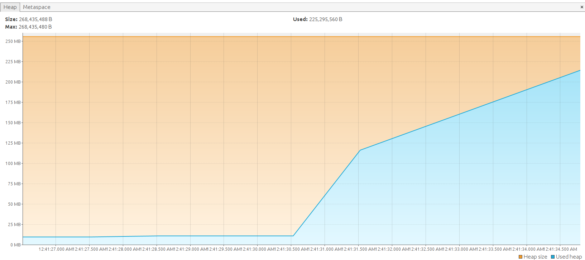
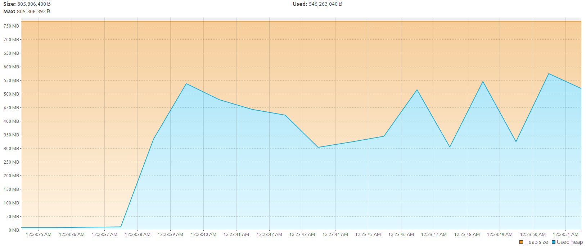
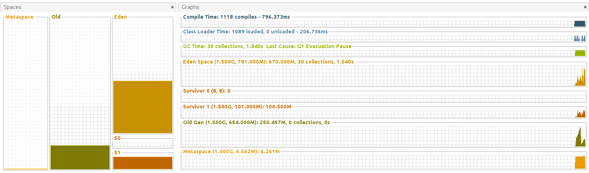

# Определение оптимального размера хипа до оптимизации
Ниже представлена таблица с временем выполнения программы.
При установке максимальной кучи на уровне 256мб в 80% запусков приложение падало при старте с ошибкой *java.lang.OutOfMemoryError: Java heap space*

| Размер кучи         | 256m         | 300m  | 512m  | 768m  | 1g    | 1.25g  | 1.5g  | 1.8g  | 2g    |
|---------------------|--------------|-------|-------|-------|-------|--------|-------|-------|-------|
| Среднее время       | N/A or 21.2s | 17.9s | 14.2s | 13.7s | 13.4s | 13.3 s | 12.9s | 12.3s | 12.8s |
| Кол-во Pause Full   | 35           | 14    | 0     | 0     | 0     | 0      | 0     | 0     | 0     |
| Кол-во Pause Young  | 608          | 442   | 104   | 62    | 46    | 38     | 30    | 23    | 25    |

Из таблицы видно, что размер **1700-1800мб** стал оптимальным размером кучи. При этом размере достигнуто наименьшее кол-во сборок мусора.

Для того, чтобы по ходу работы программы не делать выделение памяти, параметры *-Xms* и *-Xmx* сделаны равными.

Далее показаны скриншоты VisualVM, показывающие кол-во сборок мусора в каждом из поколений.

## Информация о работе приложения при разных размерах кучи в VisualVM до оптимизации кода
### 256Мб

### 300Мб

### 512Мб

##768Мб

### 1024Мб

### 1280Мб

### 1536Мб

### 1796Мб

### 2048Мб

# Оптимизация кода приложения
## Состояние до оптимизации
До оптимизации приложение падало при размере кучи 256мб. Если посчитать итоговый размер данных в куче, то получится:

Общее кол-во созданных объектов *Data* за время работы программы:
*total_data_count*=**100 000 000**

*Минимальное кол-во созданных объектов *Data* до реального освобождения места (ведь не факт что сборка мусора начнется сразу после вызова метода clear()):
*min_data_count*=**6 600 000**

Хранение одного экземпляр класса *Data* означает хранение:
* самого объекта класса Integer, который содержит *mark word* (**8 байт**) и *class pointer* (**4 байта**) + *размер примитивного значения типа int* (**4 байта**). Итого **16 байт**. 
* *mark word* (**8 байт**) и *class pointer* (**4 байта**) + *ссылку на экземпляр класса Integer* (**4 байта**, не 8, так как размер кучи меньше 32гб). Итого 16 байт.

Итого: *data_size* = **32 байта**

В программе используется ArrayList для хранения объектов. Для хранения *N* объектов в массиве нужно *N* * 4 байт.

Итого, в процессе работы программы данные будут занимать как минимум:
*min_data_count* * 4 + *min_data_count* * *data_size* = (4 + 32) * 6 600 000 = **237 600 000 байт**.

## Что можно улучшить
### Память
Если хранить в классе Data не ссылку на Integer, а значение примитивного типа *int*, то один экземпляр класса *Data* будет занимать:

*mark word* (**8 байт**) + *class pointer* (**4 байта**) + *размер примитивного значения типа int* (**4 байта**) = **16 байт**.

Хранение *min_data_count* объектов в массиве будет занимать:

*min_data_count* * 16 + *min_data_count* * 4 = **132 000 000 байт**. Экономия памяти на 44%!

### Производительность
Класс *Summator* внутри метода *calc* выполняет арифметические операции с экземплярами класса *Integer*.
Это означает что в процессе операций выполняет их распаковка (boxing) и в конце обратная упаковка (unboxing).
Это влияет на производительность негативным образом.

### Какая оптимизация была проведена
В классе *Summator* и *Data* типы полей стали примитивными (int), а не ссылочными (Integer). Это серьезно улучшило потребление памяти и производительность.
Результаты тестов далее.

# Результаты тестов после оптимизации
При установеке размера кучи в 256мб приложение стало работать стабильно.

| Размер кучи         | 256m | 512m | 768m | 1g   | 1.25g | 1.5g | 1.8g | 2g   |
|---------------------|------|------|------|------|-------|------|------|------|
| Среднее время       | 3.5s | 2.6s | 2.7s | 3.1s | 2.9s  | 2.9s | 3.0s | 2.9s |
| Кол-во Pause Full   | 2    | 0    | 0    | 0    | 0     | 0    | 0    | 0    |
| Кол-во Pause Young  | 83   | 21   | 17   | 17   | 16    | 16   | 16   | 16   |

## Информация о работе приложения при разных размерах кучи в VisualVM после оптимизации кода

### 256мб

### 512Мб

### 768Мб

### 1024Мб

### 1280Мб

### 1536Мб

### 1796Мб

### 2048Мб

# Выводы

Прежде чем пытать менять параметры запуска JVM лучше поискать недочеты в коде программы, так как оптимизировать исходный код программы быстрее и проще.
Обычно менять параметры JVM приходится только в исключительных случаях.